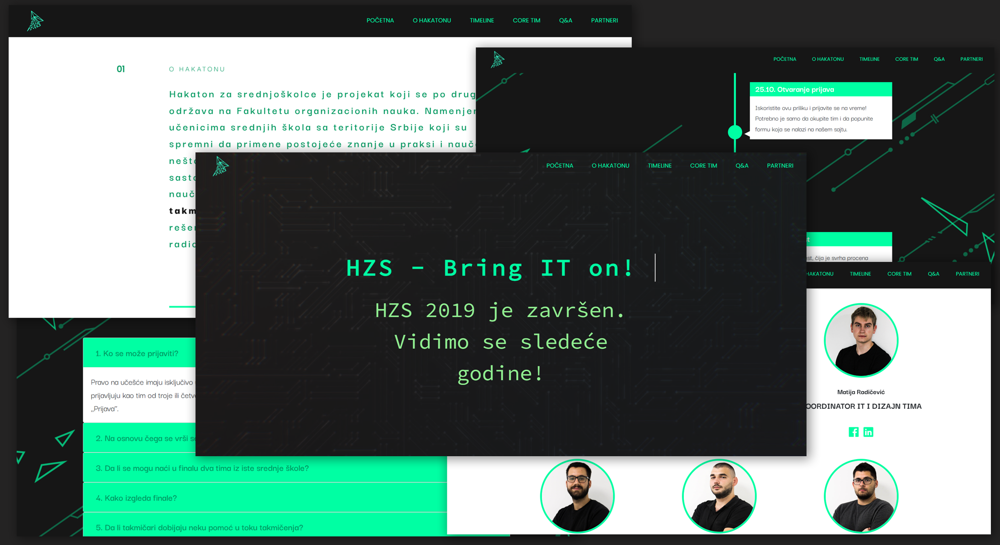

# High School Hackathon Website - Static Website

> Static website built with the HTML & CSS & JavaScript.

This is a website made for promoting the project High School Hackathon using JavaScript.

<!-- toc -->

- [Features](#features)
- [Usage](#usage)

<!-- tocstop -->

## Features

- Sidebar with basic navigation to each section
- Static info separated within several sections
- Modern design
- Ability to apply for a hackathon via dynamic form

## Usage

- Install Live Server extension
- Start the Live Server

---
